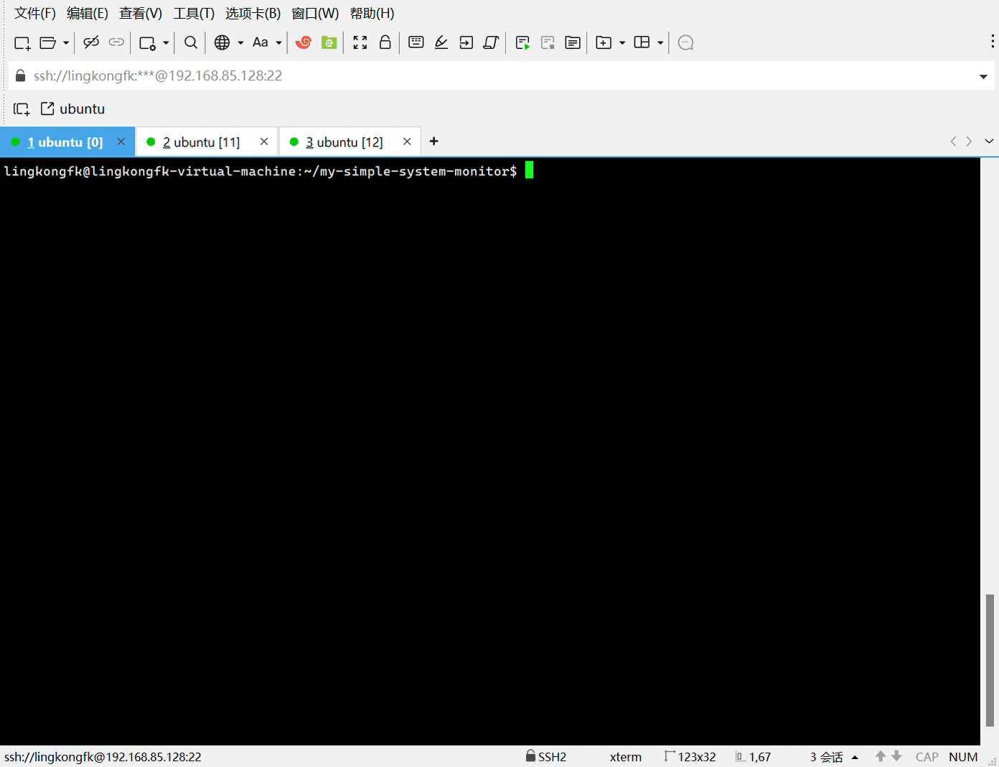
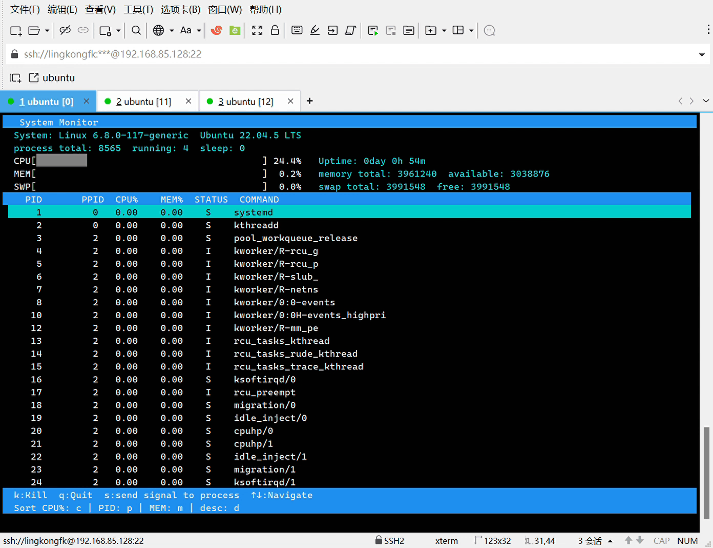
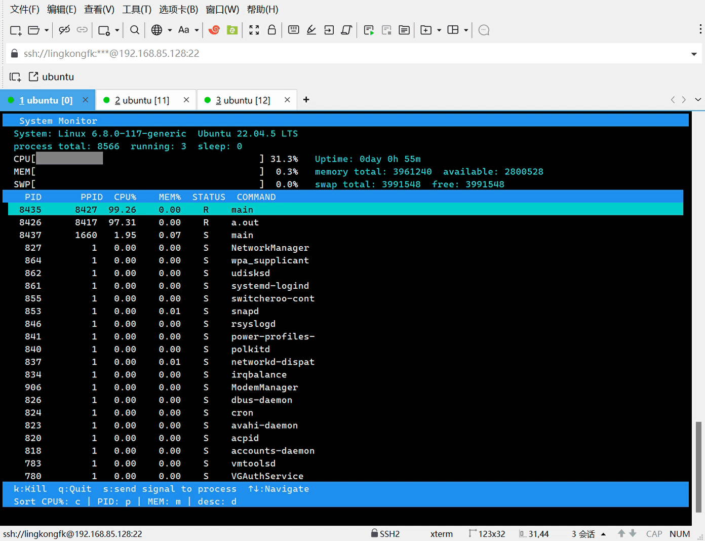
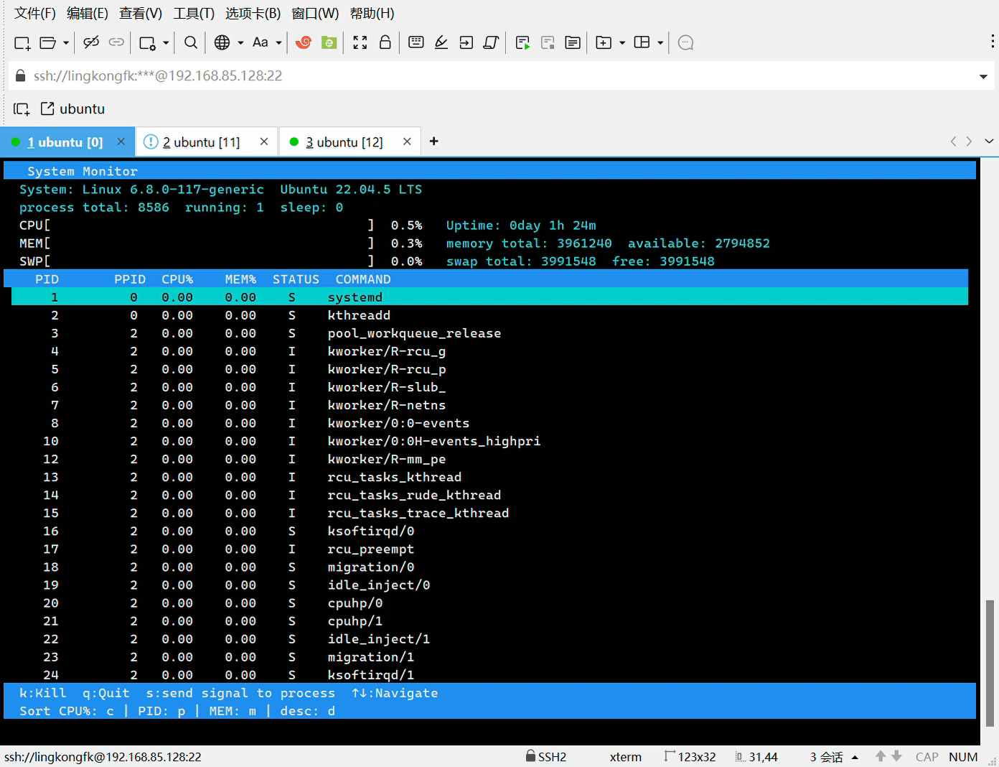

# my-simple-system-monitor
一个基于ncurses库制作的linux系统进程监控工具，支持查看系统内核、运行时间、CPU、内存等核心指标，以及对进程进行多维度的排序和管理
## 如何上手
**环境要求:**
- 操作系统: Linux (Ubuntu)
- 编译器: GCC/G++ (支持 C++11 或更高版本)
- 构建工具: CMake 3.10+
- 依赖库: ncurses


通过git克隆项目到本地

`git clone https://github.com/Lingkongfk/my-simple-system-monitor.git`

切换到项目目录，使用CMake进行编译
```
cd my-simple-system-monitor
cd build
cmake ..
make
```

项目目录下生成可执行程序main，直接运行
`./main`

## 功能演示
### **运行main文件之后进入系统UI界面**

 


### **在界面中按下相关排序按键对界面进程进行排序**

**CPU占用率: c  内存占用率: m  pid排序: p    升序/降序: d**

 


### **在界面中按下相关按键对界面进程发送信号**

**方向键上下切换选择进程   发送SIGKILL: k    发送常用信号: s**

 


### **在界面中按下q键关闭工具**

 


 
